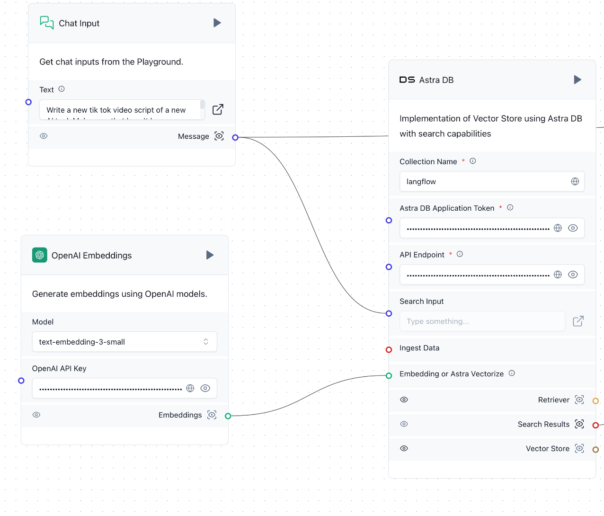

# AI Content Machine: Post Generation and Engagement Metrics Prediction Agent

This project implements an agent that interacts with a CSV file containing data and metrics from various posts. The agent performs two main tasks:

1. **Generation of new posts**: Based on historical data, the agent generates new content.
2. **Engagement metrics prediction**: The agent predicts the engagement metrics of the new posts based on the historical data.

## Features

- Loads data from a CSV file containing metrics of previous posts.
- Automatically generates new posts.
- Predicts engagement metrics using the historical post data.
- User-friendly interface that integrates functionalities via a visual interface based on Langflow.

## Dependencies

This project uses [Langflow](https://github.com/logspace-ai/langflow) as the workflow framework, which allows you to easily configure and connect different components. The main dependencies are:

- Python 3.8 or higher
- Langflow
- AstraDB

## Installation

Follow the steps below to set up the project:

1. Install Langflow using `pip`:
   ```bash
   pip install langflow
   ```

2. Run Langflow:
   ```bash
   langflow run
   ```

3. Open your browser and go to `http://localhost:7860` to access the Langflow graphical interface.

## Configuration

After starting Langflow, follow these steps to configure the agent:

1. Upload the "Task Tiktok videos agent.json" inside the designated section:  
   
2. In the Langflow interface, enter the necessary **API keys**. You must provide an OpenAI API Key and your AstraDB settings, such as the URL and key.
   
3. Enter the **CSV file** in the corresponding component:  
   
   
   Also, upload the CSV file into the CSV agent section:  
   


## Usage

- The agent will load data from the CSV and allow you to generate new posts based on previous metrics.
- It will also predict the engagement metrics of the new posts using the historical data.

Simply run Langflow and provide the correct information in the graphical interface to execute new predictions or generate new posts.

